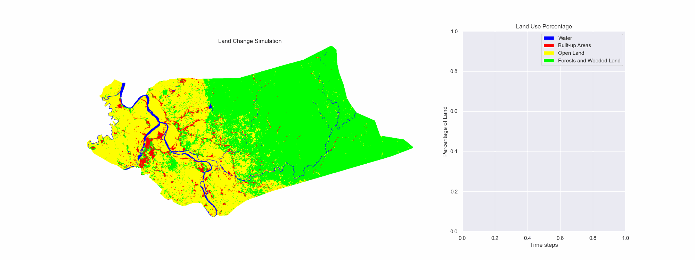

# Cellular Automata and Markov Chain Land Use Change Simulation

This repository contains all relevant files for a land use change simulation project using cellular automata and Markov chains. The project focuses on modeling land use transitions in Ilagan City, Philippines, combining spatial dynamics with probabilistic transitions to simulate future land cover scenarios.

## 📋 Project Overview

This simulation project integrates **Cellular Automata (CA)** with **Markov Chain** analysis to model and predict land use changes over time. The methodology combines:

- **Cellular Automata**: Models spatial interactions and neighborhood effects in land use transitions
- **Markov Chains**: Provides probabilistic transition matrices for land cover changes
- **Geographic Data Processing**: Utilizes real shapefile data for Ilagan City

## 🗺️ Study Area

The simulation focuses on **Ilagan City**, located in Isabela Province, Philippines. The study incorporates:

- High-resolution land cover data
- Municipal boundary information
- Four primary land cover classes:
  - Forests and Wooded Land
  - Open Land  
  - Built-up Areas
  - Water Bodies

## 🔬 Methodology

### Land Cover Classification
The simulation operates on a 4-class land cover system:
- **Class 0**: Forests and Wooded Land
- **Class 1**: Open Land
- **Class 2**: Built-up Areas  
- **Class 3**: Water Bodies
- **Class 4**: Outside Territory (excluded from simulation)

### Transition Modeling
- Markov chain transition matrices derived from historical land use data
- Cellular automata rules incorporating neighborhood effects
- Population growth integration for urban expansion modeling
- Multiple simulation runs for uncertainty analysis

## 📁 File Structure

### Core Notebooks
- **`cellular_automata.ipynb`** - Main simulation engine using AgentPy framework
- **`get_initial.ipynb`** - Initial state preparation and land cover analysis  
- **`get_transitions.ipynb`** - Markov chain transition matrix calculation
- **`read_map.ipynb`** - Geographic data processing and visualization

### Data Files
- **`initial_states.npy`** - Processed initial land cover state array
- **`Ilagan_City_shapefile/`** - Geographic boundary and attribute data
- **`Municipalities/`** - Regional municipal boundary data
- **`Transitions/`** - Transition matrices for different simulation runs
  - `run1.npy`, `run2.npy`, `run3.npy`

### Map Visualizations
- **`map_images/`** - Generated land cover and state visualization maps
  - `Ilagan_City_land_cover.png` - Base land cover map
  - `Ilagan_City_states.png` - Classified state map
  - Border variants with territorial boundaries

### Simulation Results
- **`Results/`** - Complete simulation outputs organized by run
  - **`run1/`, `run2/`, `run3/`** - Individual simulation results
    - `simulation.gif` - Animated simulation progression
    - `final_config.png` - Final land use configuration
    - `lineplot.png` - Temporal trend analysis
    - `stackplot.png` - Stacked area chart of land use proportions
    - `sim_results.csv` - Detailed simulation time series
    - `mult_sim_comparison.png` - Multi-run comparison
    - `mult_sim_results.csv` - Aggregated results across runs

### Documentation
- **`CSCI215_Malubay_Paper.pdf`** - Academic paper documentation
- **`CSCI215_Project_Report.pdf`** - Detailed project report
